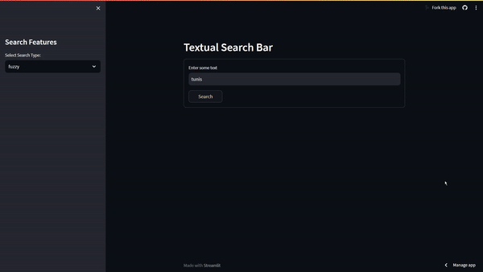
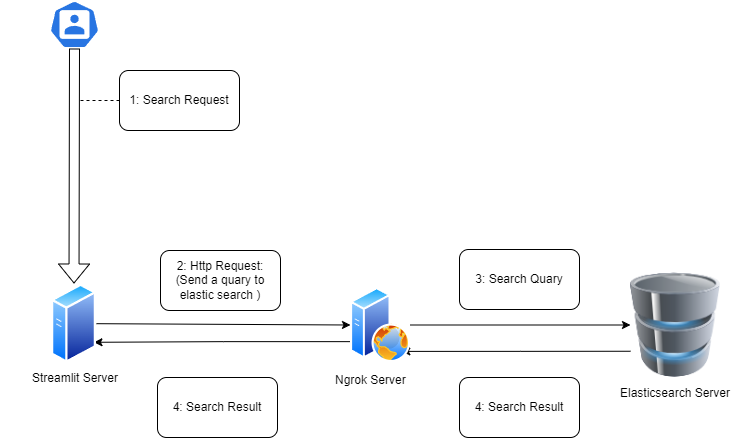

# Textual Search Engine with Elasticsearch, Streamlit, and ngrok

## Overview

Welcome to the Textual Search Engine project! [This application](https://soulaimene-textual-search-streamlitapp-aetig0.streamlit.app) is designed to provide users with a powerful and user-friendly way to search through large volumes of text data using Elasticsearch, present the results through a Streamlit web interface, and make it accessible to anyone with the help of ngrok for easy sharing.
### Demo : 

### Key Features

- **Elasticsearch Integration:** Leverage the robust Elasticsearch search engine to efficiently index and search through our textual data.

- **Streamlit Web Interface:** Create an intuitive and interactive user interface using Streamlit, making it easy for users to search and explore our data.

- **ngrok Integration:** Seamlessly share your application with others by tunneling it through ngrok, allowing for easy access from anywhere with an internet connection.

## Mechanism: Exposing Our Application with ngrok

One of the key features of this Textual Search Engine is its accessibility over the internet. This is made possible by using ngrok, a powerful tool that creates a secure tunnel between our local machine and the ngrok servers, allowing our application to be accessible via a public URL.

Here's how the mechanism works:

1. **Localhost Setup:** Our Elasticsearch server is running locally on our computer, and the Streamlit web interface is configured to serve our application on port 9600.

2. **Using ngrok:** To make our locally hosted application accessible over the internet, we employ ngrok. Ngrok opens a secure tunnel to our local machine and assigns it a public URL. When you, the user, access this ngrok-assigned public URL, you're actually interacting with the elasticsearch.

3. **HTTP Request Forwarding:** When you click the search button on our Streamlit application, an HTTP request is sent. This request is forwarded to the ngrok server.

4. **Routing to Elasticsearch:** The ngrok server, in turn, forwards your HTTP request to our localhost where the Elasticsearch server is running. Elasticsearch processes the request, performs the search, and generates a response.

5. **Response Routing:** After processing your request, Elasticsearch sends the response back to the ngrok server running on our local machine.

6. **Response to Streamlit:** Finally, the ngrok server forwards the response back to your Streamlit application through the ngrok-assigned public URL. You can then see the search results displayed in the Streamlit web interface.

In summary, ngrok acts as a bridge between your web browser and our locally hosted Elasticsearch server via the Streamlit application, allowing you to search through text data over the internet with ease.

